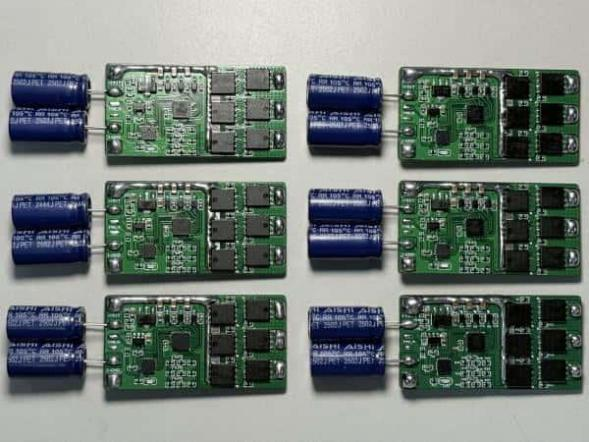

# 基于 CH32V203 的单体无刷电调

## 项目背景

本项目是一款面向无人机、航模和机器人动力系统的单体无刷电调硬件。它的核心目标很朴素：用相对常见、成本可控、可打样复现的器件，做出一块能在真实电流和真实温升条件下工作的电调板，而不是只停留在原理图上的“看起来能跑”。

项目采用沁恒 CH32V203F8U6 作为主控，FD6288Q 作为三相栅极驱动，HYG015N04 作为功率 MOSFET，支持 4-6S 电池输入。它更适合作为学习和验证无刷电机驱动的基础项目：一方面可以观察三相桥、栅极驱动、供电路径和散热设计之间的关系；另一方面也可以为后续四合一电调、飞控动力系统和机器人执行器供电控制积累经验。

做电调很容易在细节上翻车，比如驱动电源不稳、MOSFET 温升过高、烧录点不好用、大电流路径压降明显、地线回流影响 MCU 稳定性等。这个项目的意义正在于把这些硬件工程问题摆到台面上，通过可打开的工程文件和测试记录，让后来者能看到一块电调从设计到验证的完整过程。

当前目录包含立创 EDA 专业版硬件工程文件：

- ProPrj_CH32v203 jlc又打样 优化三项供电路径，烧录点_2026-08-23.epro2

## 设计目标

单体电调的定位不是“功能越多越好”，而是先把一个电机通道做稳、做透。相比四合一电调，单体电调更适合做原理验证和极限测试，因为它的供电路径、发热位置、驱动波形和故障现象更容易观察，也更便于对某一个设计点反复修改。

本项目主要关注以下目标：

- 支持 4-6S 电池输入，覆盖常见无人机和航模动力电压。
- 在较高电流下保持稳定运行，重点验证功率器件、散热和供电路径。
- 使用 CH32V203F8U6 作为国产 RISC-V MCU 控制核心，便于后续固件开发和移植。
- 使用 FD6288Q 完成三相栅极驱动，降低 MCU 直接驱动功率管的复杂度。
- 优化三项供电路径和烧录点，让样板调试更顺手。
- 保持硬件工程结构清晰，方便其他人打开、复查和二次设计。

## 功能特性

- 支持 4-6S 宽电压输入。
- 主控 MCU 采用 CH32V203F8U6。
- 栅极驱动采用 FD6288Q。
- 功率 MOSFET 采用 HYG015N04。
- 电源方案采用 78L12 降压至 12V，ME6214 降压至 3.3V。
- 适用于单路无刷电机驱动验证、航模动力测试和电调固件实验。
- 已在 16V、35A、微风条件下稳定运行 1000s，温度稳定在 80℃以内。
- 最大测试功率约 700W。
- 工程文件中已体现供电路径和烧录点优化，便于样板阶段反复调试。

## 硬件构成

硬件可以分成五个主要部分：输入供电、逻辑供电、主控、栅极驱动和三相功率输出。输入供电来自 4-6S 电池，经过电源转换后分别给栅极驱动和逻辑系统供电。CH32V203F8U6 负责产生控制信号，FD6288Q 负责把控制信号转换为适合驱动 MOSFET 的栅极信号，HYG015N04 组成三相桥，最终驱动无刷电机。

在这个项目里，大电流路径和散热比“功能列表”更重要。单体电调承受的是实打实的电流，铜皮宽度、过孔数量、MOSFET 布局、驱动芯片距离、地线回流路径都会影响最终表现。README 不能替代硬件审图，但希望能帮助读者先理解这块板的设计意图，再打开工程文件看细节。

## 安装与打开工程

1. 安装立创 EDA 专业版。
2. 克隆或下载本项目仓库。
3. 使用立创 EDA 专业版打开 ProPrj_CH32v203 jlc又打样 优化三项供电路径，烧录点_2026-08-23.epro2。
4. 检查原理图、PCB、BOM、封装映射和关键功率器件参数。
5. 重点检查输入电源、大电流铜皮、三相输出、驱动电源、烧录点和地线回流。
6. 根据需要导出 Gerber、BOM 和贴片坐标文件。
7. 若需要固件调试，请准备 WCH-Link、CH32V203 开发环境、无刷电机、电子负载或安全测试台。

## 使用示例

建议从低风险流程开始复现。首先不要直接接大功率电池和电机，而是在限流电源下检查 12V 和 3.3V 电源是否正常，确认主控和驱动芯片没有异常发热。然后连接调试器，确认烧录点可用，MCU 能被识别和下载程序。接着再接入无刷电机，先用低占空比或低油门空载运行，观察启动是否顺畅、三相输出是否正常、驱动芯片是否稳定。

进入功率测试时，建议分阶段记录数据：输入电压、平均电流、运行时间、MOSFET 温度、驱动芯片温度、电机负载状态和环境风量。项目资料中已经给出 16V、35A、微风条件下连续运行 1000s 的结果，后续如果继续维护仓库，可以把这类测试做成表格，并补充热成像图或温度曲线。这样的记录很适合放在开源项目主页里，比一句“可以稳定运行”更有说服力。

## 技术架构

- 控制层：CH32V203F8U6 负责 PWM 输出、换相控制、输入信号解析和保护逻辑。
- 驱动层：FD6288Q 将 MCU 控制信号转换为三相 MOSFET 栅极驱动信号。
- 功率层：HYG015N04 MOSFET 组成三相桥式功率输出，承担电机驱动电流。
- 电源层：78L12 提供 12V 驱动电源，ME6214 提供 3.3V 逻辑电源。
- 调试层：烧录点和控制信号接口用于固件下载、参数调试和电机控制输入。
- 可靠性层：通过供电路径优化、功率器件选型和 PCB 热设计支撑高电流连续运行。

## 测试记录

当前已有成果包括：支持 4-6S 宽电压输入；在 16V、35A、微风条件下温度稳定在 80℃以内并连续运行 1000s；最大测试功率约 700W。这些数据说明项目已经经过较高功率下的实际验证。后续建议继续补充不同电压、电流、风冷条件下的测试结果，尤其是 4S、5S、6S 电池输入时的温升和稳定性对比。

## 项目照片

本仓库已补充 `photo/` 目录，用于展示单体无刷电调装置实物。完整照片说明见 `docs/PHOTOS.md`。

## 开源说明

本仓库开放单体无刷电调的硬件工程、测试文档和实物照片，方便其他人学习三相桥、栅极驱动、电源路径和高电流散热设计。后续建议继续补充测试视频、温升记录、BOM / Gerber 导出文件、固件说明和常见故障排查。

## 后续计划

- 补充原理图模块说明，尤其是三相驱动、电源和烧录接口。
- 补充固件编译与烧录流程。
- 整理高电流测试表格，记录温升、电压、电流和运行时间。
- 补充安全注意事项，例如上电限流、桨叶拆除、高温器件防护等。
- 对比后续四合一电调项目，总结单体电调向多通道集成迁移时需要注意的问题。

## Documentation Index

- [Source code archive notes](docs/SOURCE_CODE.md)
- [Source archive manifest](docs/SOURCE_MANIFEST.md)
- [Firmware usage notes](docs/FIRMWARE_USAGE.md)
- [Source verification checklist](docs/SOURCE_VERIFICATION.md)
- [Assessment evidence checklist](docs/ASSESSMENT_EVIDENCE.md)
- [Project photos](docs/PHOTOS.md)
- [Open-source evidence index](docs/OPEN_SOURCE_EVIDENCE.md)
## Source Code

本仓库已补充源码压缩包 `code/ch32v203-single-esc-source-code.zip`，包含单体无刷电调相关固件源码。源码归档说明、SHA256 校验值和打包边界见 `docs/SOURCE_CODE.md`。

## License

This hardware design is released under CERN Open Hardware Licence Version 2 - Permissive (CERN-OHL-P-2.0). See LICENSE. If firmware is added later, place a separate software license in the firmware directory.

